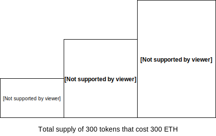
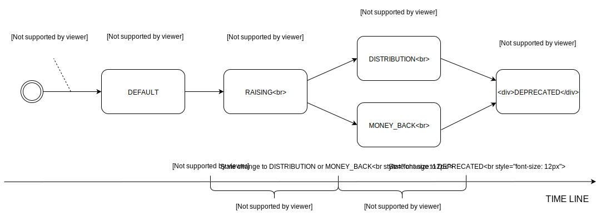
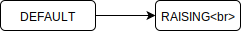
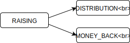
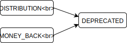

# IMPORTANT! Not for production usage. This is still alpha.

# ISAO Smart Contract

### What is ISAO?

ISAO - Initial Smart Asset Offer is the procedure of issuance of security or utility tokens for assets and is one of the core parts of BANKEX proof of asset protocol. By assets, we mean anything that has value or is able to generate cash flow.

Full ISAO procedure includes several steps including KYC, Asset Verification & Legal. ISAO smart contracts help organize the very last step of ISAO - issuing, selling, and the distribution of tokens.

ISAO smart contracts can be used in wide range of products including ICO.

### Supported Features

ISAO Smart contact allows to raise funding on any ERC20 token in several steps, with a different amount of the tokens supply and price on each step of ISAO. It also supports the following features:

- A minimal amount of ETH to become an investor
- A minimally required funding to consider ISAO successful
- Funding stairs
- Money back procedure in the case when not enough ETH was raised
- Distribution stage
- Deprecated stage
- Testing contract

Smart asset offering occurs in two stages: raising and token distribution. At first stage, investors send ether to contract and buy rights to get tokens. If the contract does not reach the minimal value of collected ether during raising time, investors can refund their ether back. If it reaches, we wait until raising time will be over (or admin switch contract to token distribution mode manually, or it reaches hard cap), after that investors can use their rights and get their tokens. You can find the detailed description below.

Features to be implemented:

- Sending the funds to the owner of the asset rather than to the administrator
- Administrator's fee can be set as a fixed amount or an interest

### Quick Start

You can check the demo project [here](https://isao.staging.bankex.team).

If you want to deploy your own contract in the Ethereum test network:

1) Clone this repo and run `npm install`, also you'll need `truffle` installed globally so check the instructions [here](https://github.com/trufflesuite/truffle), on how to install it.

2) Register in https://infura.io/ and copy your API KEY. It will allow you to deploy the contract to the  Ethereum network without maintaining the full node. 

3) Create .env file in the root folder with the next content:

```
ETH_KEY=PRIVATE_KEY # private key of your ethereum account
INFURA_TOKEN=TOKEN  # Infura API key
```

4) Use `truffle migrate --reset --network rinkeby`  or  ``truffle.cmd migrate --reset --network rinkeby` on windows. It will deploy ISAO contract and related ERC20 token contract on rinkeby testnet. All the required parameters such as `RAISING_PERIOD ` and `MINIMAL_FUND_SIZE ` will be setup in the migration script  that you can find in `./migrations/2_isao_test.js` file.

*Note: Deploy can take more than 0.5 ETH in the testnet, so be sure you have enough test ether on you account.*

5) Find ISAO contract address in the console output:

```
Address of ERC20 token: --- You'll find the address here ---
Address of ISAO: --- You'll find the address here ---
```

Now you have the instance of the test contract deployed in the test network. You can play around with it using *remix* and *remixd*. Notes: 

* For *remixd* set `./contracts` folder as shared folder for *remixd*.
* **Important**! Migration by default deploys **testing** contract that allows to change time internal time for testing purposes. To get access to testing features select and compile *ISAOTest.sol* file in the *Remix IDE*

## Roles in ISAO

The main participants in the procedure of ISAO are originator (asset owner), administrator and shareholders. The contract contains only the following roles not including the originator:

1. DEFAULT - shareholder, It refers to the `RL_DEFAULT` constant in the code. 
2. ADMIN  - a manager who creates the contract and gets the interest from ISAO. It refers to the `RL_ADMIN` constant in the code. 
3. PAYBOT -  it’s another account of ADMIN, designed to help automate things, the only difference is that bot can't take funds from a deprecated contract. It refers to the `RL_PAYBOT` constant in the code. 


## Funding Stairs
Funding stairs defines steps of contract funding. For example if we going to raise 300 ETH in 3 steps it can looks like that:
<p align="center">
  
</p>


## Sequence of states
Contract bypass next state sequence during its life cycle:



##### 1. Contract deployment 


Initially, administrator of the ISAO should deploy contract to the Ethereum network. For the production deploy you can use `truffle migrate --network YOUR_NETWORK`. You also deploy contract with a factory contract as it done in our demo project;

The important thing that administrator should set specify following parameters at the deployment stage:

- Raising and Distribution periods

- Minimal fund size ( soft cap )

  *Note: you should specify it in the tokens, so if you know a minimal amount of ETH you want to raise, you need to calculate amount of tokens according to your funding stairs*

- Limits of tokens and prices on each stage that define funding stairs

  *Note: these parameters together define hard cap*

- Minimal deposit for the investor

- Admin and paybot address

You can check constructor signature to see the details. Also, you can see an example of testing contract creation in `./migrations/2_isao_test.js` file. It assigns sample values to all the required parameters;

After deployment the contract gets `DEFAULT` state. In the code you can find `ST_DEFAULT = 0x00 ` and `TST_DEFAULT = 0x00 ` which is the same, just `TST_DEFAULT`  is used in the test contact version.


##### 2. Change state from DEFAULT  to RAISING



###### DEFAULT STATE

In state parameters of the ISAO contact are set and can't be changed, except related ERC20 token address. To set it you need to call `setERC20Token` method on ISAO contract. This method is defined in the base `ERC20Cassette ` contract.

The following requirements must be met before administrator will be able to change state to RAISING:

- The related ERC20 token is set in the ISAO contract
- ISAO contact have enough supply of related ERC20 token

Administrator or paybot call `setState` method and pass `ST_RAISING = 0x01 ` as an argument.

###### RAISING STATE

At that state investors can by tokens by sending ETH to the contract or calling payable `BuyShare ` function, it will assign a proper number of tokens according with funding stage in the internal ISAO token balance storage.


##### 3. Change state from RASING to DISTRIBUTION or MONEY_BACK




Raising period can be stopped by one of the following reasons:

- When the hard cap is raised the contract automatically goes into the `DISTRIBUTION` state
- When the soft cap hasn't been collected during the raising period, the contract goes into the `MONEY_BACK` state
- When the soft cap is raised and administrator changes the contact state into `DISTRIBUTION`
- At any moment before the hard cap is raised, the administrator has the right to change the contract's state into `MONEY_BACK` even soft cap is raised.

The distribution period starts when the contract gets into `DISTRIBUTION` or `MONEY_BACK` state. 

Duration of the distribution period is set in the constructor at the moment of contract creation 


###### DISTRIBTUTION STATE

In the DISTRIBUTION state investors should transfer tokens they bought from the ISAO contract to their own wallets. They can do it by:

- Calling a payable function on the contact. In that case, all the tokens will be transferred to the caller account. If caller pay any ETH with transaction ISAO contract return it;
- Calling `releaseToken` function. In that case, a caller should specify a number of tokens that he wants to transfer to his account.

Administrator or paybot can force distribution by transfer tokens to the owners, they can do that by calling `releaseTokenForce ` method.

Also, at that state administrator can take raised during ISAO by calling `releaseEtherToStakeholderForce` method on the contract. 

*Note: at the moment that readme was written, the administrator is only one of possible stakeholders of ISAO. We going to add asset owner in the future.*


###### MONEY_BACK STATE

In the MONEY_BACK state, investors should request back ETH they. They can do it by:

- Calling a payable function on the contact. In that case, all the ETH will be transferred to the caller account. If caller pay any ETH with transaction ISAO contract return it to the caller;

- Calling `refundShare` function. In that case, a caller should specify an amount of tokens that he wants to refund back to ETH to his account.


##### 4. Change state from DISTRIBUTION or MONEY_BACK to DEPRECATED



When distribution period ends, the contract automatically changes its state to DEPRECATED. 

###### DEPRECATED STATE

In that state, the administrator can take unclaimed funds of the ISAO contract, such as ETH and related ERC20 token as well as any token that belongs to contract.

## Documentation for the developers
You can find [documentation](https://bankex.github.io/isao-contract/) here.