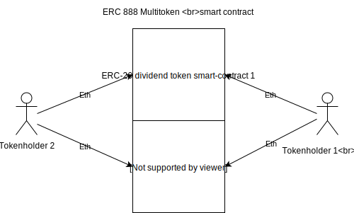
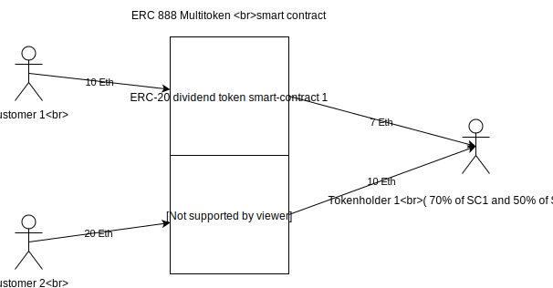
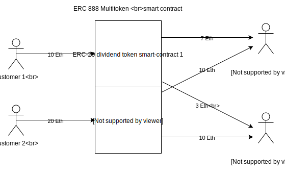

# ERC-888 Multitoken
That contract is an [ERC888](https://github.com/ethereum/EIPs/issues/888)  token implementation. Contract specification allows you to store and manage multiple ERC-20 tokens inside of the single ERC888 contract. When you call ERC-20 token method that stored inside ERC888, you additionally specify the ID of the ERC-20 token.

ERC888 multitoken works the following way: assume that there are two smart-contracts with ERC-20 tokens, which have different IDs (smart-contract 1 of vending machine which sells coffee and smart-contract 2 of vending machine which sells mineral water) both of them have 100 tokens in total  and they are stored in ERC-888 multitoken smart-contract. Two tokenholders buy tokens of these smart contracts so that tokenholder one has 70 ‘coffee tokens’ and 50 ‘water tokens’, and the second tokenholder has 30 ‘coffee tokens’ and 50 ‘water tokens’.  



Then, Customer 1 buys coffee for 10 Eth and Customer 2 buys mineral water for 20 Eth. As ERC-888 multitoken contains two ERC-20 dividend tokens with different IDs, dividends are distributed just like in case with ERC-20 dividend token. After that tokenholders are able to release their dividends using function ***`releaseDividendsRights`*** and receive ethers. Tokenholder one can receive 7 Eth from smart-contract 1 and 10 Eth from smart-contract 2, and tokenholder two can receive 3 and 10 Eth from these smart-contracts respectively.

### For tokenholder 1:



### For tokenholder 2:



# Multitoken - ERC888 Implemantation, with additional divedends payout feature
## About
That contract is [ERC888](https://github.com/ethereum/EIPs/issues/888) token implementation.
  Contract specification allows you to store and manage multiple ERC20 tokens inside of the single contract ERC888 contract.
  When you call ERC20 token method that stored inside ERC888, you additionally specifies Id of the ERC20 token.
  
  Our implementation also has an additional dividends payout feature. You can find the overview [here](https://blog.bankex.org/dividend-payout-bankex-tests-the-newest-token-standard-erc-888-aff5a1fb14eb).
  
  You can check the demo project here: [https://multitoken.bankex.team](https://isao.staging.bankex.team).
  List of all smart contracts you can find in the root [readme](../).

# Specification

### Methods
##### totalSupply
Returns the total token supply by it's **ID**
```js
  function totalSupply(uint256 _tokenId) external view returns (uint256)
```
##### balanceOf
Returns the account balance of token by it's **ID** of another account with address _owner
```js
  function balanceOf(uint256 _tokenId, address _owner) external view returns (uint256)
```
##### allowance
Returns the amount of tokens by it's **ID** which _spender is still allowed to withdraw from _owner.
```js
  function allowance(uint256 _tokenId, address _owner, address _spender) external view returns (uint256)
```
##### approve
Allows _spender to withdraw tokens by it's **ID** from your account multiple times, up to the _value amount. If this function is called again it overwrites the current allowance with _value.
```js
  function approve(uint256 _tokenId, address _spender, uint256 _value) external returns (bool)
```
##### transfer
Transfers _value amount of tokens by it's **ID** to address _to, and MUST fire the Transfer event. The function SHOULD throw if the _from account balance does not have enough tokens by it's **ID** to spend.
```js
  function transfer(uint256 _tokenId, address _to, uint256 _value) external returns (bool)
```
##### transferFrom
Transfers _value amount of tokens from address _from to address _to, and MUST fire the Transfer event.
```js
  function transferFrom(uint256 _tokenId, address _from, address _to, uint256 _value) external returns (bool)
```
### Events
##### Transfer
A token contract which creates new tokens by it's **ID** SHOULD trigger a Transfer event with the _from address set to 0x0 when tokens are created.
``` java
  event Transfer(uint256 indexed tokenId, address indexed from, address indexed to, uint256 value)
```
##### Approval
MUST trigger on any successful call to `approve`(uint256 _tokenId, address _spender, uint256 _value)
``` java
  event Approval(uint256 indexed tokenId, address indexed owner, address indexed spender, uint256 value)
```
### Deployment
 Run ganache or geth: 
- Use `truffle migrate --network ganache` to  deploy contract on ganache.
- Use
```bash
geth --dev --rpccorsdomain="*" --rpcaddr="0.0.0.0" --rpc --rpcapi="personal,eth,net,debug,web3,db,admin" --networkid 7555  --dev.period=1
```
to setup remix compatible debug supporting test ethereum blockchain and `truffle migrate --network geth_dev` to deploy the contract.

Strictly recommended to use solium linter. `solium -d contracts`
If you have compilation errors due to `emit Event` in solidity, update truffle.


## For developers

|||
|---|---|
| utility token natspec documentation | [link](https://bankex.github.io/multi-token/docs/MultiToken/)  |
| security token natspec documentation  | [link](https://bankex.github.io/multi-token/docs/MultiDividendsToken/) |
